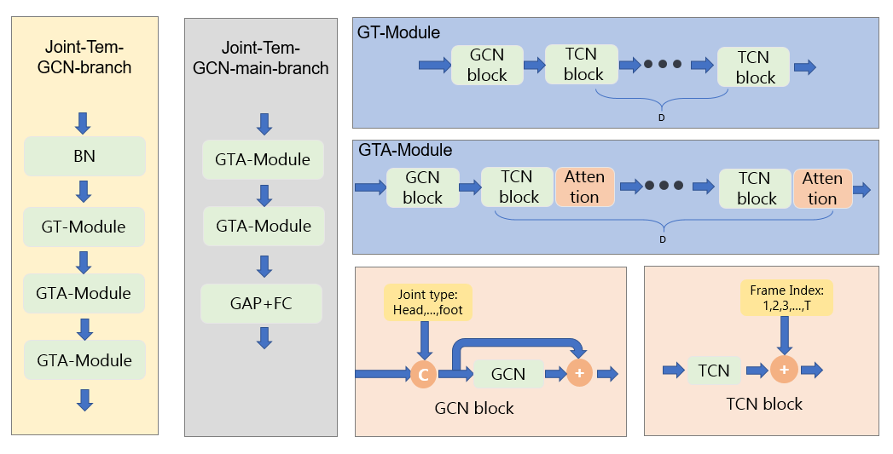

# EfficientGCN-v2

#### 介绍
在EfficientGCNv1的基础上引入了时间语义信息和节点语义信息的升级版，我们叫做EfficientGCN-v2。

#### 软件架构
软件架构说明

#### 训练命令

1.  生成最后结果文件。 `./submission.sh`
2.  训练模型。`./train.sh`
3.  stack boosting10折模型的结果,训练弱分类器。 `./stack-boosting.sh`

#### 单个模型框架

#### 框架内各个子模块

#### 解题思路
- 这里是列表文本数据处理：去除骨架数据中的无效帧（值等于0的帧）。 
- 数据分析：难点有以下三点： 

                &emsp;1. 类别不均衡，部分样本过少。 
                &emsp;2. 不同类别的样本有重复的片段。 
                &emsp;3. 部分样本时间长。 
- 模型建立： 
               &emsp;1. 模型选择，对比SOTA模型，我们对比实验了MS-G3D,CTR-GCN和EfficientGCN-v1模型，相比前两种对关节点和骨骼边后期的融合，我们选择了性能更优的EfficientGCN-v1作为我们的基础结构。 
               &emsp;2. 针对难点的改进(创新点)。 
                     &emsp; &emsp;2.1 引入Focal loss 损失函数，缓解类别不均衡现象。 
                     &emsp; &emsp;2.2 受SGN网络的启发，我们引入时间语义信息和节点语义信息，构建了新的子模块-GCN-block 和 TCN-block(如上图所示)。引入两种语义信息，使网络理解关节点的空间位置和时间顺序。 
                     &emsp; &emsp;2.3 针对样本时间长的现象，我们采用分段下采样的方式来解决样本时间长，训练速度慢的现象。 
                     &emsp; &emsp;2.4 尝试更换了EfficientGCN-v1的主网络结构。 
                     &emsp; &emsp;2.4 尝试加入角度流分支，最后B榜测试时未使用。 

- 所用Trick： 
               &emsp;1.  去中心化，所有节点减掉中心节点的值。 
               &emsp;2.  K折交叉验证，将训练集划分成10折进行交叉验证。 

               &emsp;3.  warm-up。 

#### 最终融合模型介绍
| 第K折 |  模型文件   | 创新点  | 准确率 |
| ----  |  ----  | ----  |   ----   |
| 第0折 | net/4BranchNetEff  | 各个branch网络修改为SGN |     -    |
| 第1折 | net/4BranchNet_with_tem2  | 在efficent_gcn基础上加入时间信息和节点信息 |     -     |
| 第2折 | net/efficent_gcn_with_joint_v3  | 在efficent_gcn基础上加入节点信息  |     -     |
| 第3折 | net/4BranchNet_with_tem2  | 在efficent_gcn基础上加入时间信息和节点信息 |     -     |
| 第4折 | net/4BranchNet_with_tem2  | 在efficent_gcn基础上加入时间信息和节点信息 |     -     |
| 第5折 | net/efficent_gcn_with_joint_v2 |在efficent_gcn基础上加入节点信息  |     -     |
| 第6折 | net/4BranchNetEff  | 各个branch网络修改为SGN |     -     |
| 第7折 | net/efficent_gcn_with_joint_v2_with_tem2  | 在efficent_gcn基础上加入时间信息和节点信息 |    -      |
| 第8折 | net/efficent_gcn_with_joint_v2_with_tem2  | 在efficent_gcn基础上加入时间信息和节点信息 |     -     |
| 第9折 | net/efficent_gcn_with_joint_v2_with_tem2  | 在efficent_gcn基础上加入时间信息和节点信息 |    -      |
| - | - | - |    B榜准确率65.45741325     |
#### 项目文件介绍
- net 存放Model 文件
- efficentgcn 存放子模块文件
- configs 存放配置文件
- utils 存放模型保存读取记录文件
- final_test_B 存放B榜最终模型与结果文件
- data1 存放离线处理后的.npy数据文件
- feeder 存放DataLoder数据读取和预处理文件
- checkpoint 存放训练模型和日志文件
- figs 存放模型示意图
#### 使用的baseline模型的github地址
`https://github.com/yfsong0709/EfficientGCNv1`
`https://github.com/microsoft/SGN`
